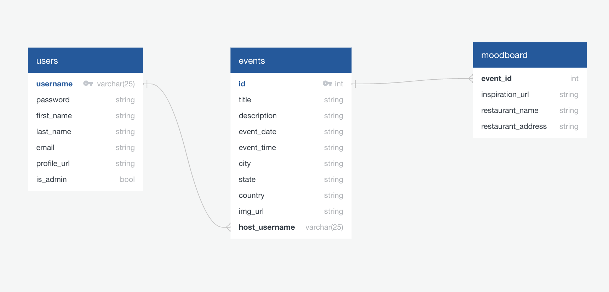
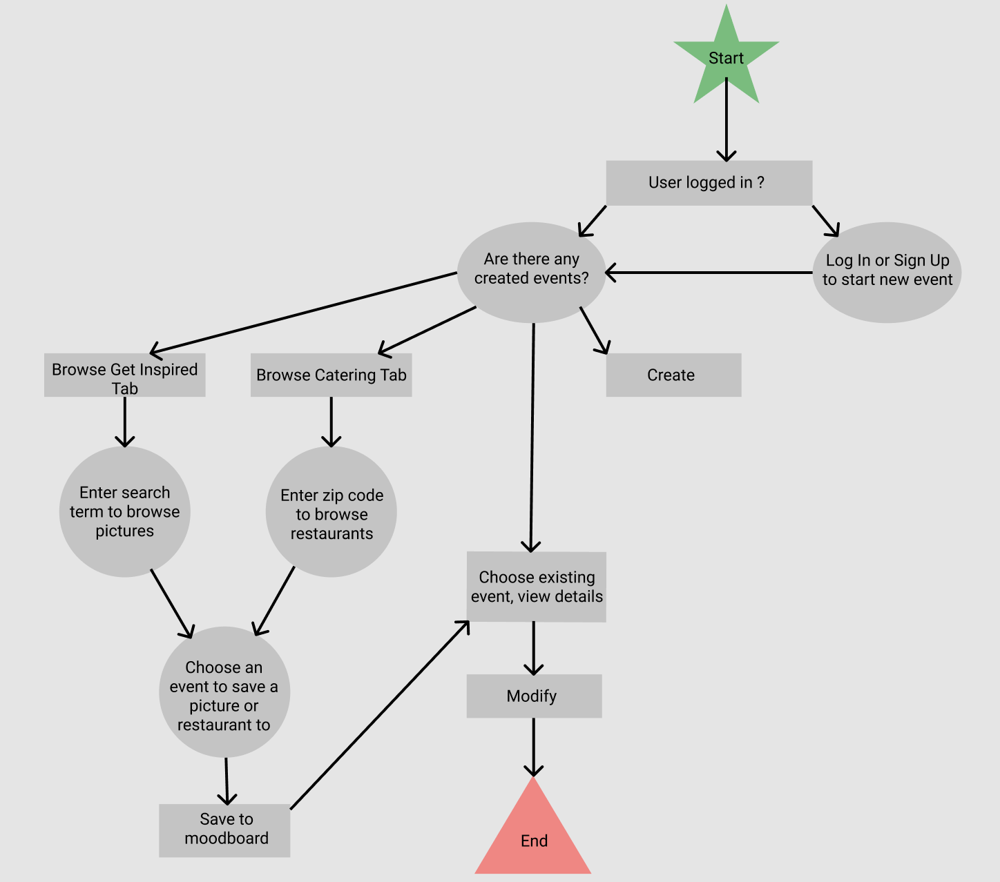

# BoogieBot Event Planner App


## Description

BoogieBot is created to help with event planning by being able to create user's own moodboard for a specific event, and search for nearby restaurants for catering options.

## Features

- login to create new events and modify them
- word search Unsplash API in Inspiration route to save pictures to a moodboard of an event of your choice
- zip code search Documenu API in Catering route to save restaurants around the area to an event of your choice
- edit user profile
- admins can create new users and modify user information as well as events information

## Installation

- clone repository using command line
  
```terminal
$git clone https://github.com/ayresjulia/Boogiebot-full-stack.git
```

- install app requirements from package.json (separately for backend and frontend)

```terminal
$cd backend
$npm install
$cd frontend
$npm install
```

- start backend of the app in localhost

```terminal
$cd backend
$nodemon server.js
```

- start frontend of the app in localhost

```terminal
$cd frontend
$npm start
```

## Tests

- to run tests for backend
  
```terminal
$jest --runInBand
```

- to run tests for frontend
  
```terminal
$npm test
```

## APIs Used

[Unsplash API](https://api.unsplash.com)
[Documenu API](https://api.documenu.com)

## Tech Stack

- Web/Frontend
  - JavaScript
  
- Frontend Libraries/Frameworks
  - React | Reactstrap | Axios
  
- Server/Backend
  - Node | PostgreSQL

- Backend Libraries/Frameworks
  - Express | Cors | Jest

## Database Schema



## User Flow



## BoogieBot Event Planner App v2.0

- delete event moodboard elements individually
